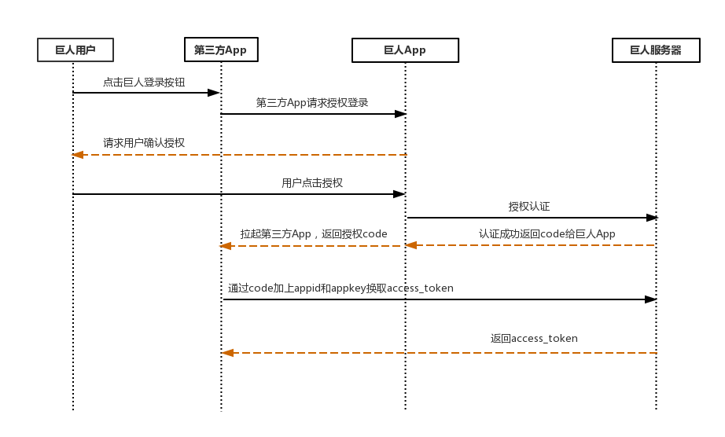
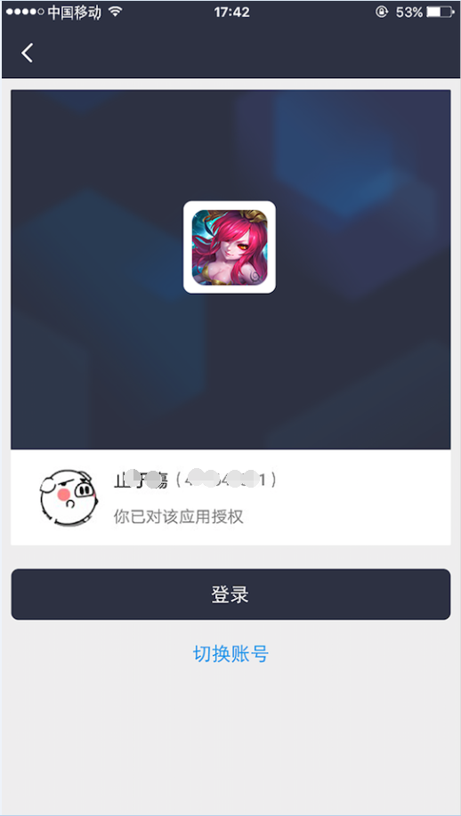

##  移动应用调用巨人账号管家授权登录指南

巨人账号管家（以下简称管家）授权登录可以让拥有巨人通行证的用户，在管家授权的情况下，第三方可以获取到用户的授权调用凭证（access_token），通过access_token可以获取巨人通行证的基本用户开放信息。

#### 准备

巨人账号管家对移动应用授权登录的协议是基于OAuth2.0协议标准构建的巨人账号管家登录系统。

在接入之前，首先联系管理人员申请一个app_id和app_key。然后就可以开始接入一个流程。

> 管理人员：翟总             
> 联系qq：1440515

```
现在移动应用的接入只提供原生应用登录，所以用户需要安装巨人账号管家1.1.2及其以上版本。
```

#### 授权流程说明

```
1. 第三方发起管家授权登录请求，唤起管家app，用户在管家里授权后，会拉起第三方应用，并且带上授权临时票据code参数；

2. 第三方应用通过code参数加上app_id以及身份校验参数，通过API换取access_token；

3. 然后第三方应用通过access_token进行接口调用，可以获取用户的基本信息等功能。
```

获取access_token的时序图：




### 第一步：请求CODE

**移动应用管家授权登录**
开发者应该使用管家官方提供的SDK进行授权登录的请求接入。正确接入SDK后，开发者移动应用会在本地拉起管家应用进行授权登录。管家用户确认后，管家将拉起开发者的移动应用，并带上授权临时票据（code）。

IOS平台授权登录接入示例：（请参考IOS的SDK）

这里是IOS的接入示例 [点击查看详细](./sdk/ios_sdk_doc.md)


Android平台接入示例（请参考Android的SDK）：

这里是Android接入示例 [点击查看详细](./sdk/android_sdk_doc.md)


参数说明：

| 参数 | 是否必须| 说明 |
| --- | --- | :--- |
| appid| 是 | 应用唯一标识，需要在官方申请后获得 |

返回示例：

| 参数 |  说明 |
| --- | :---  |
| code | 临时授权码 |
| app_id | 应用唯一标识 |


**这里可以拉起管家app**



### 第二部：通过code获取access_token

获取第一步的code之后，请求以下链接获取access_token

```
https://gamm3.ztgame.com/sns/oauth2/get_access_token?appid=APPID&code=CODE&sign=SIGN
```

**参数说明**

| 参数 | 是否必须| 说明 |
| ---  | ----   | ---  |
|appid | 是     | 应用唯一标识，需要官方申请获得 |
|code  | 是     | 第一步获取的code参数|
|sign  | 是     | 身份校验签名，见详细的[签名算法](./signAlgorithm.md) |

**返回说明**

正确的返回：
```
{
    code: 0,
    msg: '操作成功',
    data: {
        'openid': 'fCfdkJO3kJUKfEWMmn',
        'access_token': 'fdsfdsfjdklsjfldjfld',
        'refresh_token': 'fdsfdsfjdklsjfldjfld',
        'expires_in': 7200,
        'expires_in_refresh': 2592000,
    }
}
```

| 参数   | 说明  |
| ---    | ---   |
| openid | 授权用户唯一标识|
| access_token  | 接口调用凭证|
| refresh_token | 用户刷新access_token |
| expires_in    | access_token过期时间，单位(秒) |
| expires_in_refresh | expires_in_refresh过期时间，单位(秒)|

**错误返回样例：**
```
{
    code: '30001',
    msg: '签名错误',
}
```


**刷新access_token**

access_token是调用授权关系接口的凭证，由于access_token有效期只有2个小时，当access_token过期后，可以使用refresh_token进行刷新，access_token刷新有两种结果：
```
1. 若access_token过期，那么刷新refresh_token将会得到一个新的access_toekn和新的过期时间；
2. 若access_token未过期，那么刷新refresh_token将不会改变access_token，但过期时间会刷新，相当于续期access_token。
```

refresh_token拥有较长对的有效期(30天)，当refersh失效后，需要用户重新进行授权。

**请求方法**

获取第一步的code后，请求以下链接进行refresh_token：
```
https://gamm3.ztgame.com/sns/oauth2/refresh_token?appid=APPID&refresh_token=REFRESH_TOKEN&sign=SIGN
```

**参数说明**

| 参数 | 是否必须 | 说明  |
| ---  | ---     | ---  |
| appid| 是      | 应用唯一标识|
| refresh_token| 是| 填写获取的refresh_token|
| sign | 是| 签名串，见[签名算法](./signAlgorithm.md) |

**返回说明**

正确的返回：
```
{
    code: 0,
    msg: '操作成功',
    data: {
        'openid': 'fCfdkJO3kJUKfEWMmn',
        'access_token': 'fdsfdsfjdklsjfldjfld',
        'refresh_token': 'fdsfdsfjdklsjfldjfld',
        'expires_in': 7200,
        'expires_in_refresh': 2592000,
    }
}
```

| 参数   | 说明  |
| ---    | ---   |
| openid | 授权用户唯一标识|
| access_token  | 接口调用凭证|
| refresh_token | 用户刷新access_token |
| expires_in    | access_token过期时间，单位(秒) |
| expires_in_refresh | expires_in_refresh过期时间，单位(秒)|

**错误返回样例：**
```
{
    code: '30001',
    msg: '签名错误',
}
```


## 第三步：通过access_token调用接口

> 调用响应的接口，请查看对应的具体接口。

| 接口地址 | 说明(即链接) |
| ---     | ---  |
| /sns/account/userinfo| [用户信息](./apis/userinfo.md) |